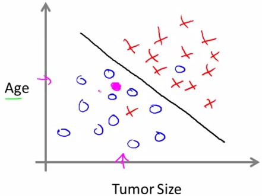

# Machine Learning - Standford - CS229

__主题: 斯坦福机器学习网络公开课__
__主讲: Andrew Ng__
__笔记作者: coreVK__
__版本: 0.0.1__
__日期: 2016.6.23__

> What is machine learning？Field the study that gives computers the ability to learn without being explicitly programmed.

#术语
1. 凸优化理论: convex optimization
2. 隐马尔科夫模型: hidden Markov models
3. 监督学习: supervised learning
4. 非监督学习: unsupervised learning
5.  回归问题: regression problem
6.  价值价格: value and price
7.  分类问题: classification problem
8.  恶性或良性: malignant or benign(医学)
9.  支持向量机: support vector machines(SVM)

#监督学习
###Housing prices(房价)

需要出售一套房子，已知该地区的房价。那么该如何估计自己房子的价格？

在图中，可以给所有散点划直线，也可以使用曲线拟合

### tumor（肿瘤）
> 在分类问题中，你需要处理的变量是离散的(discreet)而不是连续的(continuous)

良性或恶性肿瘤

把患者的年龄和肿瘤的性质作为研究问题，使用分隔线来划分类型，是一种监督是学习。下一次输入数值是使用这个算法预测肿瘤的性质。

如果数据不是变成二维三维，而是多维。那么使用支持向量机算法，把向量映射进入无限维，用来实现无限种限制。
#非监督学习
###基类问题

